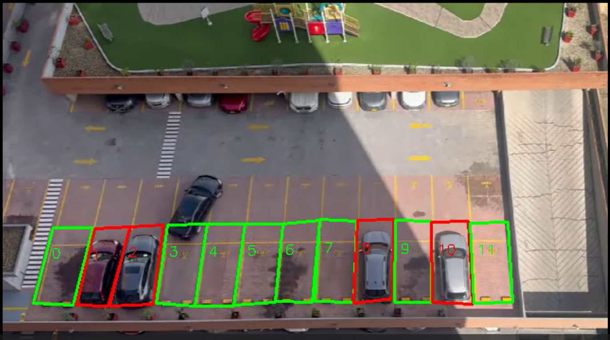
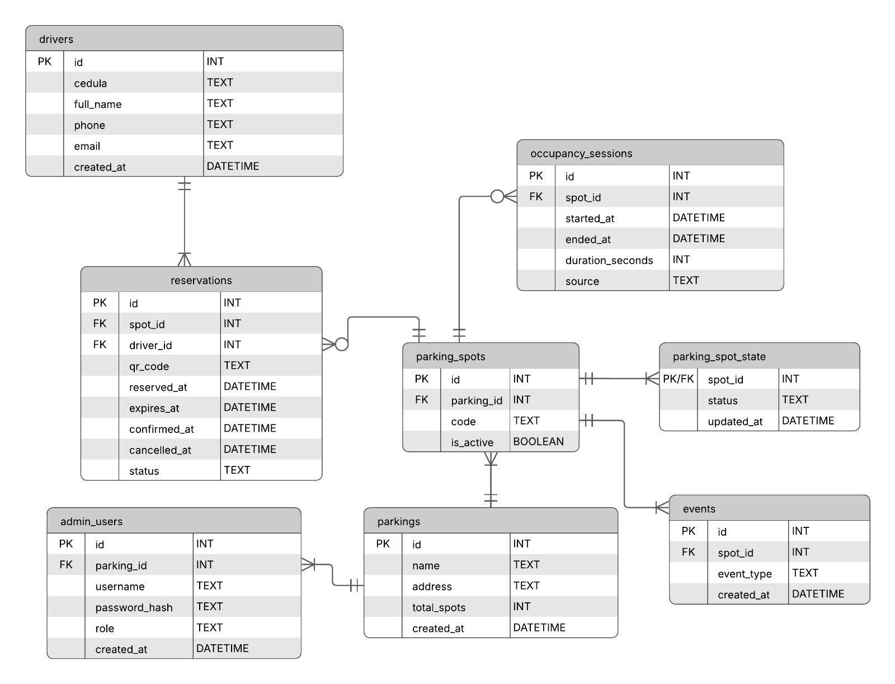

# ParkVision



Sistema inteligente de monitoreo de estacionamientos basado en **visión por computadora**, diseñado para detectar en tiempo real la ocupación de plazas, registrar sesiones de uso y generar información lista para analítica y dashboards administrativos.

Este repositorio contiene **la fase funcional validada** del proyecto: detección robusta de ocupación, eliminación de falsos positivos y persistencia confiable en base de datos relacional local.

---

## 🎯 Objetivo del proyecto

Desarrollar un sistema que permita:

- Detectar automáticamente plazas de estacionamiento **ocupadas y libres** mediante video.
- Eliminar falsos positivos usando confirmación temporal.
- Registrar **sesiones reales de ocupación** (entrada, salida y duración).
- Persistir los datos en una base de datos relacional.
- Servir como base para futuras extensiones: dashboard web, analítica, reservas y dispositivos IoT.

---

## ✅ Estado actual (funcional y probado)

✔️ Detección de vehículos con modelo YOLO entrenado  
✔️ Definición manual de plazas mediante polígonos (`bounding_boxes.json`)  
✔️ Cálculo de intersección (IoU) entre vehículo y plaza  
✔️ Confirmación temporal por frames (anti-rebotes)  
✔️ Eliminación de falsos positivos  
✔️ Registro consistente en base de datos SQLite  
✔️ Generación de video de salida con visualización de estados  
✔️ API REST servida con **Express** leyendo el estado desde SQLite  

---

## 🧠 Arquitectura actual

```
ParkVision/
│
├── data/
│   ├── database/
│   │   ├── parking.db          # Base de datos SQLite (se genera al iniciar la BD)
│   │   ├── schema.sql          # Estructura de la base de datos
│   │   └── test_seed.sql       # Datos iniciales de prueba
│   └── bounding_boxes.json     # Polígonos de plazas
│
├── src/
│   ├── db/
│   │   ├── db.py               # Inicialización de comunicación con BD (Python)
│   │   ├── init_db.py          # Inicialización de la BD
│   │   └── models.py           # Operaciones CRUD (Python)
│   │
│   ├── vision/
│   │   ├── detectionVideoReal.py # Detección con video pregrabado y lógica principal (actualiza la BD)
│   │   ├── realTimeDetection.py # Detección con camara en tiempo real y lógica principal (actualiza la BD)
│   │   └── boxes.py              # GUI para generar bounding_boxes.json
│
├── server-express/              # Backend API con Express (Node.js)
│   ├── src/
│   │   ├── db/
│   │   │   └── sqlite.js        # Conexión SQLite + helpers (Node)
│   │   ├── routes/              # Endpoints REST
│   │   │   ├── spots.js
│   │   │   └── stats.js
│   │   └── server.js            # Punto de entrada Express
│   ├── .env                     # Config (DB_PATH, PORT)
│   └── package.json
│
├── media/
│   ├── primer_frame.jpg         # Frame para marcar plazas
│   └── Park_final.mp4           # Video de prueba
│
├── results/                     # Videos procesados
├── .venv/                       # Entorno virtual Python
└── README.md
```

---

## 🗄️ Base de datos (actual)

### Entity-Relationship Diagram



ParkVision utiliza una base de datos relacional compatible con **SQLite** y **PostgreSQL**, diseñada para soportar:

- Gestión de parqueaderos
- Usuarios administrativos y operadores
- Conductores (reservas con cédula)
- Plazas de estacionamiento
- Estado en tiempo real
- Historial de ocupación
- Reservas con QR
- Auditoría completa de eventos

---

## 🎥 Flujo de funcionamiento

1. Se carga el video de entrada.
2. YOLO detecta vehículos en cada frame.
3. Se calcula IoU entre cada vehículo y cada plaza.
4. Se aplica confirmación temporal:
   - `FRAMES_OCUPADO` para marcar ocupada.
   - `FRAMES_LIBRE` para marcar libre.
5. Solo cuando el estado se **confirma**, se actualiza la base de datos.
6. Se dibuja el estado de cada plaza en el video de salida.

---

## ▶️ Ejecución (Python + Express)

Este proyecto utiliza **uv** como gestor de entorno y dependencias para Python.  
El entorno virtual no se versiona, por lo que cada usuario debe crearlo localmente.

### 🧩 Requisitos previos (visión)
- Python 3.11
- Git
- uv instalado

### 🧩 Requisitos previos (API)
- Node.js 18+ (recomendado)

---

## Instalar uv (una sola vez)

```powershell
pip install uv
```

---

## 1. Clonar el repositorio

```powershell
git clone https://github.com/juanfranciscosm/ParkVision.git
cd ParkVision
```

---

## 2. Crear el entorno virtual con uv

```powershell
uv venv
```

---

## 3. Activar entorno virtual e instalar dependencias Python

```powershell
.\.venv\Scripts\Activate.ps1
uv sync
```

Si PowerShell bloquea scripts, ejecutar una sola vez:

```powershell
Set-ExecutionPolicy -Scope CurrentUser -ExecutionPolicy RemoteSigned
```

---

## 4. Inicializar base de datos

```powershell
uv run ./src/db/init_db.py
```

> Si tu setup usa una BD demo en otra carpeta (ej. `demo_data`), asegúrate de que el módulo de visión y/o la API apunten a esa ruta.

---

## 5. Ejecutar detección (visión)

```powershell
python -m src.vision.detectionVideoReal
```

⚠️ **No ejecutar como script suelto**, siempre como módulo (`-m`).

---

## 🚀 Activación de GPU (CUDA) para procesamiento por visión

ParkVision puede aprovechar aceleración por GPU (CUDA) para el módulo de visión artificial basado en PyTorch + YOLO (Ultralytics).

### Instalar PyTorch con soporte CUDA (cu129)

```powershell
uv pip install torch==2.8.0 torchvision==0.23.0 torchaudio==2.8.0 `
  --index-url https://download.pytorch.org/whl/cu129
```

### 🧪 Verificar GPU disponible

```powershell
python .\gpu_use_test.py
```

---

## 📈 Salidas generadas

- 🎥 Video procesado con plazas coloreadas:
  - Verde → libre
  - Rojo → ocupada
- 🗄️ Base de datos actualizada en tiempo real
- 📊 Sesiones listas para analítica

---

## 🌐 Servidor Backend (API) con Express

ParkVision incluye un servidor backend desarrollado con **Express (Node.js)**, encargado de exponer la información del sistema de estacionamiento en tiempo real para su consumo por aplicaciones frontend (dashboard web, apps móviles, etc.).

El servidor **lee** el estado actual desde la base de datos SQLite, la cual es actualizada continuamente por el módulo de visión por computadora.

### 🧱 Arquitectura del Servidor

- Framework: **Express**
- Base de datos: SQLite (modo WAL recomendado)
- Patrón: API REST
- Concurrencia:
  - Escritura → módulo de visión (Python)
  - Lectura → servidor API (Node)

---

### 🚀 Cómo iniciar el servidor Express

#### 1️⃣ Configurar variables de entorno (DB y puerto)

En `server-express/.env`:

```env
PORT=8000
DB_PATH=../data/database/parking.db
```

> Si tu base está en otra carpeta (por ejemplo `demo_data`), ajusta el path, por ejemplo:
>
> `DB_PATH=../demo_data/database/parking.db`

#### 2️⃣ Instalar dependencias Node

```powershell
cd .\server-express
npm install
```

#### 3️⃣ Iniciar el servidor

Modo desarrollo:

```powershell
npm run dev
```

Salida esperada:

```powershell
Express running on http://127.0.0.1:8000
```

---

## 📡 Endpoints disponibles

### Estado de las plazas

`GET /spots/`

Respuesta:

```json
[
  {
    "id": 1,
    "code": "A1",
    "status": "FREE",
    "updated_at": "2026-01-04 20:31:10"
  }
]
```

### Estado de una plaza específica

`GET /spots/{spot_id}`

Ejemplo: `GET /spots/3`

### Estadísticas de ocupación

`GET /stats/occupancy`

Ejemplo de respuesta:

```json
{
  "total_spots": 20,
  "occupied": 8,
  "free": 12,
  "occupancy_rate": 0.4
}
```

---

## 🖥️ Uso desde el Frontend

El frontend **NO** se conecta directamente a la base de datos. Toda la información se obtiene exclusivamente a través del servidor API.

Ejemplo con JavaScript (Fetch API):

```javascript
fetch("http://127.0.0.1:8000/spots/")
  .then(res => res.json())
  .then(data => {
    console.log(data);
  });
```

Uso recomendado en frontend:

- Actualizar cada 2–5 segundos (polling) o usar WebSockets (futuro)
- No mantener conexiones largas
- Tratar la API como fuente única de verdad

---

## 📌 Nota

Este README documenta **únicamente lo que ya está implementado y probado**.  
Las futuras extensiones se desarrollarán sobre esta base estable.