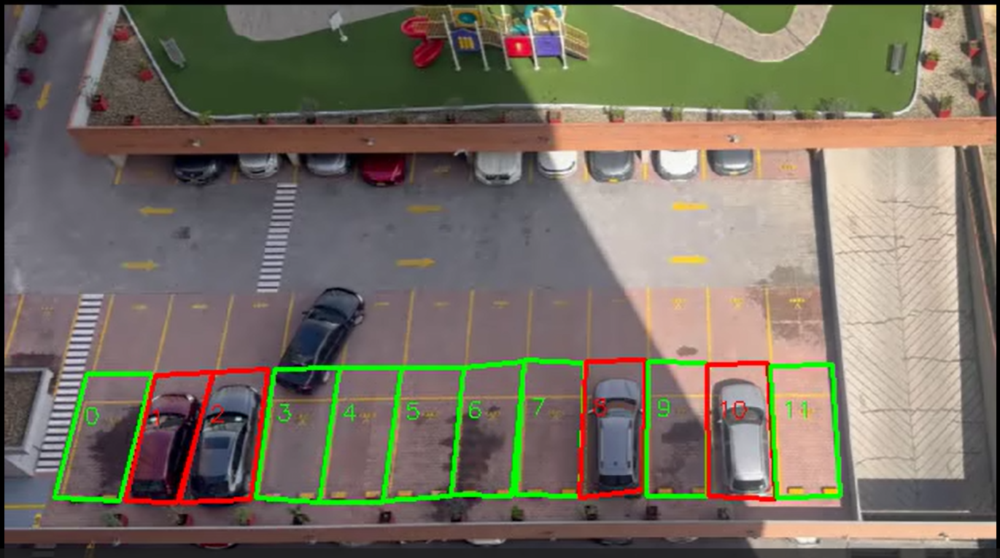
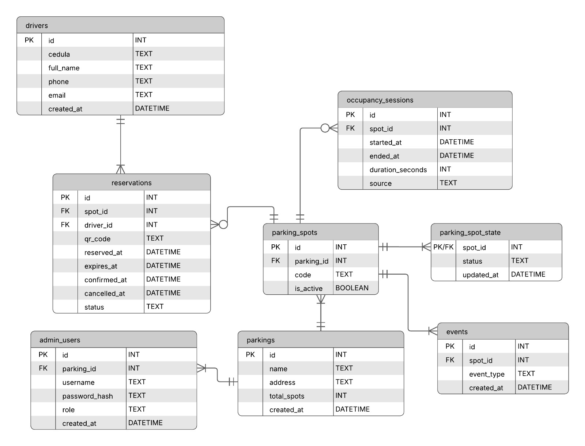

# ParkVision



Sistema inteligente de monitoreo de estacionamientos basado en **visión por computadora**, diseñado para detectar en tiempo real la ocupación de plazas, registrar sesiones de uso y generar información lista para analítica y dashboards administrativos.

Este repositorio contiene **la fase funcional validada** del proyecto: detección robusta de ocupación, eliminación de falsos positivos y persistencia confiable en base de datos relacional local.

---

## 🎯 Objetivo del proyecto

Desarrollar un sistema que permita:

* Detectar automáticamente plazas de estacionamiento **ocupadas y libres** mediante video.
* Eliminar falsos positivos usando confirmación temporal.
* Registrar **sesiones reales de ocupación** (entrada, salida y duración).
* Persistir los datos en una base de datos relacional.
* Servir como base para futuras extensiones: dashboard web, analítica, reservas y dispositivos IoT.

---

## ✅ Estado actual (funcional y probado)

✔️ Detección de vehículos con modelo YOLO entrenado
✔️ Definición manual de plazas mediante polígonos (`bounding_boxes.json`)
✔️ Cálculo de intersección (IoU) entre vehículo y plaza
✔️ Confirmación temporal por frames (anti-rebotes)
✔️ Eliminación de falsos positivos
✔️ Registro consistente en base de datos SQLite
✔️ Generación de video de salida con visualización de estados

---

## 🧠 Arquitectura actual

```
ParkVision/
│
├── data/
│   ├── database/
│   │   ├── parking.db     # Base de datos SQLite (se genera al inciar la base de datos)
│   │   ├── schema.sql     # Estructura de la base de datos
|   |   └── test_seed.sql  # Datos iniciales en base a las plazas del video de prueba + datos inventados para pruebas
│   └── bounding_boxes.json     # Polígonos de plazas
│
├── src/
│   ├── db/
│   │   ├── db.py               # Inicialización de comunicación con BD
│   │   ├── init_db.py          # Inicialización de la BD
│   │   └── models.py           # Operaciones CRUD
│   │
│   └── vision/
│       ├── detectionVideoReal.py  # Detección y lógica principal (aqui se procesa video de estacionamiento y actualiza la base de datos)
│       └── boxes.py               # Script para iniciar interfaz gráfica para generar bounding_boxes.json
│
├── media/                       
│   ├── primer_frame.jpg         # Primer frame utilizado para generar datos de las coordenadas de las plazas (bounding_boxes.json) 
│   └── Park_final.mp4           # Video de prueba de estacionamiento  
├── results/                     # Videos procesados (aqui se guarda el video procesado)
├── .venv/                       # Entorno virtual
└── README.md
```

---

## 🗄️ Base de datos (actual)

### Entity-Relationship Diagram



ParkVision utiliza una base de datos relacional compatible con **SQLite** y **PostgreSQL**, diseñada para soportar:

- Gestión de parqueaderos
- Usuarios administrativos y operadores
- Conductores (reservas con cédula)
- Plazas de estacionamiento
- Estado en tiempo real
- Historial de ocupación
- Reservas con QR
- Auditoría completa de eventos

---

### 🧱 Diagrama lógico (resumen)

- **Un Parking** tiene:
  - muchos `users`
  - muchos `parking_spots`

- **Un User** pertenece a:
  - un solo `parking`

- **Un Parking Spot**:
  - pertenece a un `parking`
  - tiene un único `parking_spot_state`
  - puede tener muchas `occupancy_sessions`
  - puede tener muchas `reservations`

- **Un Driver**:
  - puede realizar múltiples `reservations`
  - se identifica por su **número de cédula**

---

### 📌 Tablas principales

#### 1️⃣ `parkings`
Entidad raíz del sistema.

| Campo | Descripción |
|-----|------------|
| id | Identificador del parking |
| name | Nombre del parqueadero |
| address | Dirección física |
| total_spots | Número total de plazas |
| created_at | Fecha de creación |

---

#### 2️⃣ `users`
Usuarios administrativos y operadores.

| Campo | Descripción |
|-----|------------|
| id | Identificador del usuario |
| parking_id | Parking al que pertenece |
| username | Nombre de usuario (único) |
| password_hash | Hash de contraseña |
| role | `ADMIN` o `OPERATOR` |
| created_at | Fecha de creación |

👉 Cada usuario pertenece a **un solo parking**.

---

#### 3️⃣ `drivers`
Usuarios finales que realizan reservas.

| Campo | Descripción |
|-----|------------|
| id | Identificador del conductor |
| cedula | Número de cédula (único) |
| full_name | Nombre completo |
| phone | Teléfono |
| email | Correo |
| created_at | Fecha de registro |

---

#### 4️⃣ `parking_spots`
Plazas físicas de estacionamiento.

| Campo | Descripción |
|-----|------------|
| id | Identificador de la plaza |
| parking_id | Parking al que pertenece |
| code | Código interno (ej. P1, P2) |
| is_active | Plaza activa/inactiva |

👉 Una plaza pertenece a **un solo parking**.

---

#### 5️⃣ `parking_spot_state`
Estado **en tiempo real** de cada plaza.

| Estado | Significado |
|------|-------------|
| FREE | Plaza libre |
| RESERVED | Plaza reservada |
| OCCUPIED | Plaza ocupada |

✔️ Existe **una sola fila por plaza**.

---

#### 6️⃣ `occupancy_sessions`
Histórico de ocupación (visión, QR o manual).

| Campo | Descripción |
|-----|------------|
| id | Identificador |
| spot_id | Plaza |
| started_at | Inicio de ocupación |
| ended_at | Fin (NULL si sigue activa) |
| duration_seconds | Duración |
| source | `VISION`, `QR`, `MANUAL` |

👉 Base para **analítica**, **mapas de calor** y métricas.

---

#### 7️⃣ `reservations`
Reservas realizadas por conductores usando QR.

| Campo | Descripción |
|-----|------------|
| id | Identificador |
| spot_id | Plaza reservada |
| driver_id | Conductor |
| qr_code | Código QR (único) |
| reserved_at | Fecha de reserva |
| expires_at | Expiración |
| confirmed_at | Confirmación |
| cancelled_at | Cancelación |
| status | `ACTIVE`, `CONFIRMED`, `EXPIRED`, `CANCELLED` |

---

#### 8️⃣ `events`
Auditoría y trazabilidad completa del sistema.

| Campo | Descripción |
|-----|------------|
| id | Identificador |
| spot_id | Plaza (opcional) |
| event_type | Tipo de evento |
| created_at | Fecha |
| metadata | JSON con información adicional |

👉 Registra **todo lo que ocurre** (ocupaciones, reservas, expiraciones, etc.).

---

## 🎥 Flujo de funcionamiento

1. Se carga el video de entrada.
2. YOLO detecta vehículos en cada frame.
3. Se calcula IoU entre cada vehículo y cada plaza.
4. Se aplica confirmación temporal:
   * `FRAMES_OCUPADO` para marcar ocupada.
   * `FRAMES_LIBRE` para marcar libre.
5. Solo cuando el estado se **confirma**, se actualiza la base de datos.
6. Se dibuja el estado de cada plaza en el video de salida.

---

## ▶️ Ejecución

🛠️ Uso del proyecto (para quien clone el repositorio)

Este proyecto utiliza uv como gestor de entorno y dependencias.
El entorno virtual no se versiona, por lo que cada usuario debe crearlo localmente.

#### 🧩 Requisitos previos
* Python 3.11
* Git
* uv instalado

## Instalar uv (una sola vez):
```powershell
pip install uv
```

### 1. Activar entorno virtual

```powershell
git clone https://github.com/juanfranciscosm/ParkVision.git
cd ParkVision
```

### 2. Crear el entorno virtual con uv

```powershell
uv venv
```

### 3. Activar entorno virtual e instalar dependepcias

```powershell
.\.venv\Scripts\Activate.ps1
uv sync
```
Si PowerShell bloquea scripts, ejecutar una sola vez:

```powershell
Set-ExecutionPolicy -Scope CurrentUser -ExecutionPolicy RemoteSigned
```


### 4. Instalar dependencias base del proyecto

```powershell
uv sync
```


### 5. Inicializar base de datos

```powershell
uv run ./src/db/init_db.py
```

### 6. Ejecutar detección 

```powershell
python -m src.vision.detectionVideoReal
```

⚠️ **No ejecutar como script suelto**, siempre como módulo (`-m`).

---

## 🚀 Activación de GPU (CUDA) para procesamiento por visión

ParkVision puede aprovechar aceleración por GPU (CUDA) para el módulo de visión artificial basado en PyTorch + YOLO (Ultralytics).

A continuación se muestra la **secuencia exacta de comandos utilizada para habilitar la GPU correctamente** en Windows con una GPU NVIDIA.

---

### 🔧 Requisitos previos

- GPU NVIDIA compatible con CUDA
- Drivers NVIDIA actualizados
- Python **3.11**
- Gestor de entornos: **uv**
- Sistema operativo: **Windows**

---
### Instalar PyTorch con soporte CUDA (cu129)

```powershell
uv pip install torch==2.8.0 torchvision==0.23.0 torchaudio==2.8.0 `
  --index-url https://download.pytorch.org/whl/cu129
```

### 🧪 Verificar GPU disponible

```powershell
python .\gpu_use_test.py
```

---

## 📈 Salidas generadas

* 🎥 Video procesado con plazas coloreadas:
  * Verde → libre
  * Rojo → ocupada
* 🗄️ Base de datos actualizada en tiempo real
* 📊 Sesiones listas para analítica

---

## 🌐 Servidor Backend (API)

ParkVision incluye un servidor backend desarrollado con FastAPI, encargado de exponer la información del sistema de estacionamiento en tiempo real para su consumo por aplicaciones frontend (dashboard web, apps móviles, etc.).

El servidor lee el estado actual desde la base de datos SQLite, la cual es actualizada continuamente por el módulo de visión por computadora.

### 🧱 Arquitectura del Servidor

* Framework: FastAPI
* Servidor ASGI: Uvicorn
* Base de datos: SQLite (modo WAL)
* Patrón: API REST
* Concurrencia: 
  * Escritura → módulo de visión
  * Lectura → servidor API

Cada request HTTP abre su propia conexión segura a la base de datos.

### 🚀 Cómo iniciar el servidor

#### 1️⃣ Activar el entorno virtual
```powershell
.\.venv\Scripts\Activate.ps1
```

#### 2️⃣ Iniciar el servidor FastAPI

Desde la raíz del proyecto:
```powershell
uvicorn src.server.main:app --reload
```

Salida esperada:
```powershell
Uvicorn running on http://127.0.0.1:8000
Application startup complete.
```

#### 3️⃣ Ver documentación automática

FastAPI genera documentación automáticamente:

Swagger UI:
👉 http://127.0.0.1:8000/docs

Redoc:
👉 http://127.0.0.1:8000/redoc

### 📡 Endpoints disponibles

#### Estado de las plazas

GET /spots/

Respuesta:
```json
[
  {
    "id": 1,
    "code": "A1",
    "status": "FREE",
    "updated_at": "2026-01-04 20:31:10"
  }
]
```

#### Estado de una plaza específica

GET /spots/{spot_id}

Ejemplo:
GET /spots/3

#### Reservas activas

GET /reservations/

#### Estadísticas de ocupación

GET /stats/occupancy

Ejemplo de respuesta:
```json
{
  "total_spots": 20,
  "occupied": 8,
  "free": 12,
  "occupancy_rate": 0.4
}
```

### 🖥️ Uso desde el Frontend

El frontend NO se conecta directamente a la base de datos. Toda la información se obtiene exclusivamente a través del servidor API.

#### Ejemplo con JavaScript (Fetch API)
```javascript
fetch("http://127.0.0.1:8000/spots/")
  .then(res => res.json())
  .then(data => {
    console.log(data);
  });
```

### Uso recomendado en frontend

-> Actualizar cada 2–5 segundos (polling) O usar WebSockets (futuro)

-> No mantener conexiones largas.

-> Tratar la API como fuente única de verdad

---

## 📌 Nota

Este README documenta **únicamente lo que ya está implementado y probado**. Las futuras extensiones se desarrollarán sobre esta base estable.
